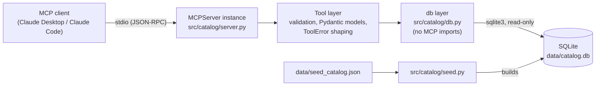

# Competitive Product Intelligence MCP Server

An MCP server that exposes a competitor product catalog to an LLM client as four typed, read-only tools: search, detail lookup, pairwise comparison, and feature-gap analysis.

## Why

A competitor catalog is too large to paste into a model's context, and pasting it is the wrong shape anyway: the model ends up re-deriving joins and comparisons from prose on every turn. Exposing the catalog as tools inverts that, so the model performs targeted retrieval — one product, one comparison, one gap report — and spends its context on reasoning rather than on rows it will not use.

The tools are typed contracts, not string formatters. Each declares a JSON Schema for its inputs and its outputs, so the model knows what arguments are legal before it calls, and receives structured data it can pass to the next tool instead of prose it has to re-parse.

## Architecture



The layers are one-directional: the db layer knows SQL and rows and imports nothing from MCP or Pydantic, the tool layer knows schemas and errors, and the server is the thin binding between them. That split is what lets the db layer be tested without a protocol and the tools be tested without a subprocess.

## Tools

| Tool | Inputs | Returns | Purpose |
|---|---|---|---|
| `search_products` | `query`, `competitor?`, `category?`, `limit=10` | `SearchResult` | Turn a keyword into product ids; every other tool needs one. |
| `get_product` | `product_id` | `ProductDetail` | One product with its full feature list and five most recent changes. |
| `compare_products` | `product_id_a`, `product_id_b` | `ComparisonResult` | Feature-level diff plus the price delta between two products. |
| `find_feature_gaps` | `our_product_id`, `competitor?`, `limit=5` | `FeatureGapReport` | Features rivals ship in a category that our product does not. |

Every tool returns `<Result> | ToolError`, never raises, and validates its arguments before touching the database.

`find_feature_gaps` is the one worth reading closely. It takes a product belonging to the competitor named `Us`, scopes the comparison to that product's own category — a feature is only a gap against something a buyer would cross-shop — and ranks results by how many distinct competitors ship each missing feature, breaking ties alphabetically so the ordering is stable across calls.

## Quickstart

```
uv sync
uv run python -m catalog.seed
uv run pytest -q
```

`data/catalog.db` is generated, not checked in. Re-running the seed command rebuilds it from `data/seed_catalog.json`; two runs of the same JSON produce byte-identical databases.

To run the server directly, which is only useful for checking that it starts:

```
uv run python -m catalog.server
```

It will sit waiting for JSON-RPC on stdin. A client is what you actually want.

## Connect to Claude Desktop

Add the server to `claude_desktop_config.json`, replacing the directory with the absolute path to this project:

```json
{
  "mcpServers": {
    "catalog": {
      "command": "uv",
      "args": [
        "--directory",
        "/ABSOLUTE/PATH/TO/catalog-mcp-server",
        "run",
        "python",
        "-m",
        "catalog.server"
      ]
    }
  }
}
```

The config file lives at:

- macOS: `~/Library/Application Support/Claude/claude_desktop_config.json`
- Windows: `%APPDATA%\Claude\claude_desktop_config.json`

Run `uv run python -m catalog.seed` once before starting Claude Desktop. If you skip it the server still starts and lists its tools, but every call returns a `DATA_UNAVAILABLE` error naming the seed command. Restart Claude Desktop after editing the config.

## Demo

<!-- TODO: demo.gif -->

The GIF should show a single Claude Desktop exchange: asking where one of our decking products falls behind, the model calling `search_products` and then `find_feature_gaps`, and the ranked gap list coming back.

## Design notes

### Typed schemas are the model's contract

Tool inputs are explicitly typed and `Field`-annotated; outputs are Pydantic models rather than dicts or pre-formatted strings. Those `Field(description=...)` strings are not maintainer documentation — they are emitted into the JSON Schema the model reads before deciding how to call, and they are the only thing that explains that `price_delta_usd` runs B minus A, or that `total_matched` counts matches before the limit. `tests/test_tool_registration.py` fails the build if any tool or any schema property loses its description, because nothing else would catch that regression.

One constraint deliberately lives in the tool body rather than the schema: bounds like `limit` 1–50 are documented in the field description and enforced in code, not declared as `ge`/`le`. A schema-level violation is rejected inside the SDK before the tool runs, which produces a protocol error rather than a `ToolError` the model can read and correct. Keeping the check in the body means every failure reaches the model in the same shape.

### Structured errors instead of exceptions

An MCP tool that raises hands the model a protocol failure with nothing actionable in it. Every failure path here returns a `ToolError` carrying a machine-checkable `code` (`INVALID_INPUT`, `NOT_FOUND`, `AMBIGUOUS_INPUT`, `WRONG_OWNER`, `DATA_UNAVAILABLE`), a message naming the offending value, and a `hint` describing the corrective call. The distinction the model acts on is `INVALID_INPUT` — reformat the argument — versus `NOT_FOUND` — the argument was well formed but names nothing, go look it up.

Messages are written for the model, not for a log reader. An unknown competitor lists the valid competitor names in the message, so the retry is possible on the model's next turn without another round trip.

Every tool body runs inside `guarded()`, which catches anything unexpected, logs it with a traceback for the operator, and returns a generic `DATA_UNAVAILABLE` to the model. Internal detail stays out of the model's context; the model still gets something it can reason about.

### Logging goes to stderr

Under the stdio transport, stdout *is* the wire protocol. A single stray `print()` writes bytes into the JSON-RPC stream and corrupts the session, usually with an error that points nowhere near the cause. There is no `print()` in this project — ruff's `T20` rule is enabled to keep it that way — and logging is configured with `stream=sys.stderr`. A missing database is reported through a returned error rather than a crash at import time, so a misconfigured install produces a server that starts and explains itself.

### Test strategy

Tests run against an in-memory SQLite database built from a small fixture payload in `tests/conftest.py` and injected into the db layer, so they never touch `data/catalog.db` and do not depend on each other's ordering. The fixture is built with the same `build_database` the real seed uses, which means the DDL under test is the DDL that ships.

The suite is layered to match the code: `test_db.py` exercises SQL and row shapes with no MCP involved, `test_tools.py` calls the tool functions directly and asserts on returned models, and `test_tool_registration.py` inspects the registered tool surface as a client would list it. Every failure assertion checks that the call returned rather than raised — "did not raise" is part of the contract, not an implementation detail.

The fixture data is shaped to make ordering assertions real: two of its competitors share the word "Cascade" so ambiguous resolution has something to be ambiguous about, and two gap features tie on competitor count while arriving in the wrong order, so a count-only sort fails the tie-break test.

## Project structure

```
.
├── README.md
├── pyproject.toml                # deps, entry point, pytest and ruff config
├── src/
│   └── catalog/
│       ├── __init__.py
│       ├── server.py             # MCPServer instance + @mcp.tool() definitions
│       ├── models.py             # Pydantic input/output models
│       ├── db.py                 # sqlite3 access layer (no MCP imports)
│       ├── errors.py             # ToolError + error-shaping helpers
│       └── seed.py               # builds catalog.db from seed_catalog.json
├── data/
│   ├── seed_catalog.json         # checked-in deterministic sample data
│   └── catalog.db                # generated; gitignored
└── tests/
    ├── conftest.py               # in-memory DB fixture
    ├── test_db.py
    ├── test_tools.py
    └── test_tool_registration.py
```

## Swapping the domain

The domain lives in `data/seed_catalog.json` and `src/catalog/models.py`. To retarget the server at a different vertical, replace the seed file, adjust the model field descriptions, and rewrite the tool docstrings. The db layer, error handling, and test scaffolding are domain-agnostic.
